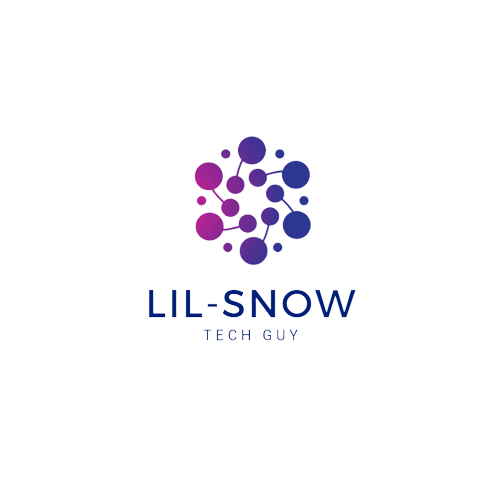

<a name="readme-top"></a>

<div align="center">
  
  <br/>

  <h3><b>Gamers' Creed</b></h3>

</div>

# 📗 Table of Contents

- [📖 About the Project](#about-project)
  - [🛠 Built With](#built-with)
    - [Tech Stack](#tech-stack)
    - [Key Features](#key-features)
- [💻 Getting Started](#getting-started)
  - [Setup](#setup)
  - [Prerequisites](#prerequisites)
  - [Install](#install)
  - [Usage](#usage)
  - [Run tests](#run-tests)
  - [Deployment](#deployment)
- [👥 Authors](#authors)
- [🔭 Future Features](#future-features)
- [🤝 Contributing](#contributing)
- [⭐️ Show your support](#support)
- [🙏 Acknowledgements](#acknowledgements)
- [📝 License](#license)

# 📖 Gamers' Creed <a name="about-project"></a>

**Gamers' Creed** is an innovative and visually stunning web application that redefines the way we experience and interact with games.

## 🛠 Built With <a name="built-with"></a>

### Tech Stack <a name="tech-stack"></a>

<details>
  <summary>Client</summary>
  <ul>
    <li><a href="https://reactjs.org/">React.js</a></li>
  </ul>
</details>

### Key Features <a name="key-features"></a>

- **Home page**
- **Detail page**
- **Game Search feature with title**
- **Game Search feature with lowest Price**

<p align="right">(<a href="#readme-top">back to top</a>)</p>

## 💻 Getting Started <a name="getting-started"></a>

To get a local copy up and running, follow these steps.

### Prerequisites

In order to run this project you need:

- Nodejs
- A text editor of your choice
- A properly working pc or laptop

### Setup

Clone this repository to your desired folder:

```sh
  cd my-folder
  git clone https://github.com/lilskyex0x/Gamers-Creed.git
```

### Install

Install this project with node packages:

```sh
  cd my-project
  npm install
```

### Usage

To run the project, execute the following command:

```sh
  npm start
```

### Run tests

To run tests, run the following command:

```sh
  npm jest
```

### Deployment

You can deploy this project using: GitHub but if you want to deploy make sure you let me know first :3

<p align="right">(<a href="#readme-top">back to top</a>)</p>

## 👥 Authors <a name="authors"></a>

👤 **Aung Pyae Khant**

- GitHub: [Aung Pyae Khant](https://github.com/lilskyex0x)
- Twitter: [Aung Pyae Khant](https://twitter.com/LilSn0w45)
- LinkedIn: [Aung Pyae Khant](https://linkedin.com/in/aung-pyae-khant-932342251)

<p align="right">(<a href="#readme-top">back to top</a>)</p>

## 🔭 Future Features <a name="future-features"></a>

- [x] **Design for Home page**
- [x] **Design for Detail page**

<p align="right">(<a href="#readme-top">back to top</a>)</p>

## 🤝 Contributing <a name="contributing"></a>

Contributions, issues, and feature requests are welcome!

Feel free to check the [issues page](../../issues/).

<p align="right">(<a href="#readme-top">back to top</a>)</p>

## ⭐️ Show your support <a name="support"></a>

If you like this project, please, share it with your friends.

<p align="right">(<a href="#readme-top">back to top</a>)</p>

## 🙏 Acknowledgments <a name="acknowledgements"></a>

I would like to thank Nelson Sakwa on Behance for letting me build this awesome project.

<p align="right">(<a href="#readme-top">back to top</a>)</p>

## 📝 License <a name="license"></a>

This project is [MIT](MIT.md) licensed.

<p align="right">(<a href="#readme-top">back to top</a>)</p>
